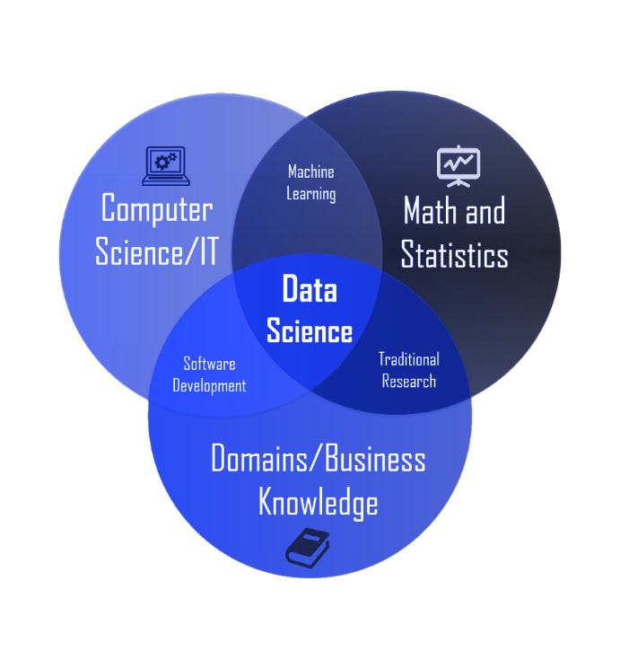

# 100DaysofMLCode
So, I've been learning about Machine learning and Data Science
since a few months now but it's mostly scattered in bits and patches
across my handwritten notes, google keep, and jupyter notebook.

Hence, I've decided to upload my daily learnings in the related domains
here at this repo! 
Each day will have a seperate folder (self explanatory)

Follow me on twitter for I'll be daily uploading a summary of the there 
as well.

## [Day 1](https://github.com/Anann99/100DaysofMLCode/tree/main/Day%201)

- Started the course [Image Processing in Python]() on DataCamp.
  - Completed 45% of the 1st module, i.e., Introducing Image Processing and scikit-image.
  - Learnt about RGB to grayscale conversion
  - Flipping the image 
- Went through the Methodology and Experimental Setup section of my research paper titled "Deep Learning based Smart Ensembled Framework for Garbage Classification". 90% of the paper is done, only the formatting and a little documentation is left.
  

## [Day 2](https://github.com/Anann99/100DaysofMLCode/tree/main/Day%202)

- Joined cohere for AI community and maneuvered around the various discord channels and discussions it has to offer.
- Getting started with zero shot and few shot learning. Watched the lecture [FSL and ZSL Part 1](https://youtu.be/ppC9ruaVuQQ). Attaching a couple of related papers in the [day 2](https://github.com/Anann99/100DaysofMLCode/tree/main/Day%202) folder which I'll read in the coming days.

## [Day 3]()

- Continuing this repo after an interruption that was uncalled for. 
- Completed the [Introduction to Machine Learning](https://student.deepracer.com/learn) at one go (Thought of participating in AWS Deepracer league but reinforcement learning ain't my thing)
  

## [Day 4]()

- Went through the numpy notes that I created almost a year ago. 
- Numpy operations
  

## [Day 5]()

- 
- 
- 

## [Day 6]()

- 
- 
- 

## [Day 7]()

- 
- 
- 

